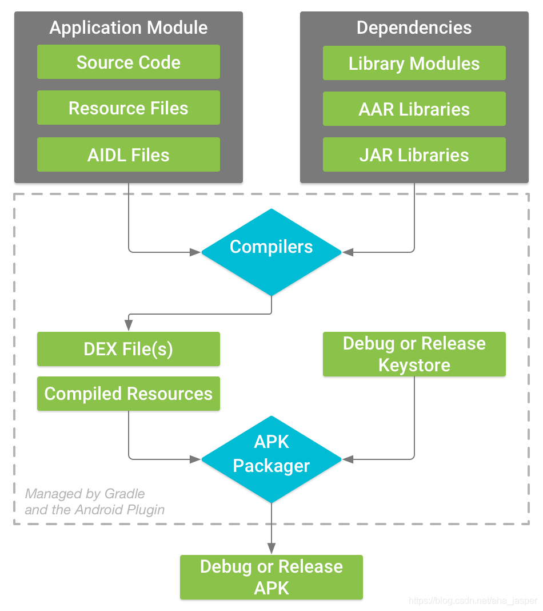
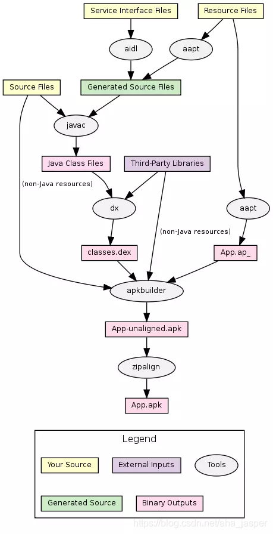

# Apk打包流程






# 手动打包apk

> 打包环境Windows电脑，不过命令应该都是一致的,需要提前把\SDK\build-tools\33.0.1添加到环境变量，或者下面的命名直接使用全路径

1、切换到项目根目录

```shell
cd ManualBuildApk
```

2、编译资源文件

```shell
aapt2 compile --dir .\app\src\main\res\ -o .\compiled\res.zip
```

3、链接资源文件

```shell
aapt2 link .\compiled\res.zip -o compiled\output.apk -I D:\DEV\SDK\platforms\android-31\android.jar  --manifest .\app\src\main\AndroidManifest.xml --java app/src/main/java
```

4、java转class

```shell
javac -cp D:\DEV\SDK\platforms\android-31\android.jar -d compiled/  .\app\src\main\java\com\compose\manualbuildapk\*.java
```

5、class转dex

```shell
d8 --output compiled/ --lib D:\DEV\SDK\platforms\android-31\android.jar .\compiled\com\compose\manualbuildapk\*.class
```

6、合并dex与资源文件

```shell
zip -j compiled\output.apk compiled\classes.dex
```

如果使用window系统没有zip命令，**可以直接解压output.apk，然后把classes.dex放进去，然后压缩，改后缀为apk文件**

7、签名Apk

```shell
apksigner sign -ks .\debug.jks .\compiled\output.apk
```

本示例**签名文件密码为111111**

说明：

为了能打包通过，删除了非android.jar里面的属性、class

# 命令解析

## aapt2编译

[官方文档](https://developer.android.com/studio/command-line/aapt2?hl=zh-cn)

使用 `compile` 的一般语法如下：

```shell
aapt2 compile path-to-input-files [options] -o output-directory/
```

#### 示例:打包单个文件

```shell
aapt2 compile project_root/module_root/src/main/res/values-en/strings.xml -o compiled/
aapt2 compile project_root/module_root/src/main/res/drawable/myImage.png -o compiled/
```

aapt2 会自动将输出文件命名为 `values-en_strings.arsc.flat`。不过，存储在 drawable 目录中的已编译可绘制对象文件的文件名将为 `drawable_img.png.flat`

踩坑：**-o后面指定的目录必须存在，不然会提示下面两个错误**

```shell
error: 设备不识别此命令。 (22)
系统找不到指定的文件。 (2)
```

#### 示例:打包多个文件

当然我们也可以使用`--dir`来指定一个目录进行编译，这样每一个flat文件就会放在compiled目录下面

```shell
aapt2 compile --dir project_root/module_root/src/main/res/ -o compiled/
```

-o参数除了指定文件夹以外，还可以直接指定文件名，这样就会生成res.zip文件，解压以后就是所有的flat文件了这个zip文件(可以直接去链接)

```shell
aapt2 compile --dir project_root/module_root/src/main/res/ -o compiled/res.zip
```

| 参数    | 说明                                                         |
| ------- | ------------------------------------------------------------ |
| --dir   | 指定要在其中搜索资源的目录。虽然您可以使用此标记通过一个命令编译多个资源文件，但这样就无法获得增量编译的优势。因此，此标记不应被用于大型项目。 |
| -o path | 指定已编译资源的输出路径。也可以直接指定一个压缩文件         |

## aapt2链接

使用`link`语法如下，**多个文件使用空格隔开**

```shell
aapt2 link path-to-input-files [options] -o outputdirectory/outputfilename.apk --manifest AndroidManifest.xml
```

#### 示例

```shell
aapt2 link .\compiled\res.zip -o compiled\output.apk -I D:\DEV\SDK\platforms\android-31\android.jar  --manifest .\app\src\main\AndroidManifest.xml --java app/src/main/java
```

| 参数   | 说明                                                         |
| ------ | ------------------------------------------------------------ |
| -I     | 提供平台的 `android.jar` 或其他 APK（如 `framework-res.apk`）的路径，这在构建功能时可能很有用。 |
| --java | 指定R.java生成的位置                                         |

这个示例使用zip文件来链接多个flat文件，也可以使用-R参数来一个个文件指定

```shell
 aapt2 link -R "@allFlatFile.txt" -o compiled\output.apk -I D:\DEV\SDK\platforms\android-31\android.jar  --manifest .\app\src\main\AndroidManifest.xml --java app/src/main/java  --auto-add-overlay
```

| 参数 | 说明                                                         |
| ---- | ------------------------------------------------------------ |
| -R   | 包含所有flat文件路径的txt文件，里面使用空格隔开，需要搭配--auto-add-overlay使用 |

**Windows电脑使用@allFlatFile.txt需要使用引号括起来**,**allFlatFile里面的内容得用空格隔开**

#### 资源id固定

当我们链接一次文件resources.arsc里面会分配一个id，当我们修改了资源文件，比如在colors.xml里面新增了一个图片，那么可能会导致两次链接的同一个资源的id发生变化

| 参数              | 说明                                                         |
| ----------------- | ------------------------------------------------------------ |
| --emit-ids path   | 在给定的路径下生成一个文件，该文件包含资源类型的名称及其 ID 映射的列表。它适合与 `--stable-ids` 搭配使用。 |
| --stable-ids path | 使用通过 `--emit-ids` 生成的文件，该文件包含资源类型的名称以及为其分配的 ID 的列表。 |

## javac

```
javac -cp android.jar -d compiled/  .\app\src\main\java\com\compose\manualbuildapk\*.java
```

| 参数            | 说明                                                         |
| --------------- | ------------------------------------------------------------ |
| -cp(-classpath) | 当前要编译的 java 文件中引用了其它的类(比如说：继承)，但该引用类的 .class 文件不在当前目录下，这种情况下就需要在 javac 命令后面加上 -classpath 参数 |
| -d              | class输出路径                                                |

可以手动指定java文件的位置，空格键隔开，也可以直接传递文件的类型

```shell
javac -cp android.jar -d compiled/ "@allJavaFile.txt"
```

**allJavaFile.txt里面的内容一行一个**


# 参考文档

> https://juejin.cn/post/7166047548551987213#heading-6
>
> https://www.jianshu.com/p/8d3dac0e5d89
>
> https://blog.csdn.net/aha_jasper/article/details/104944929